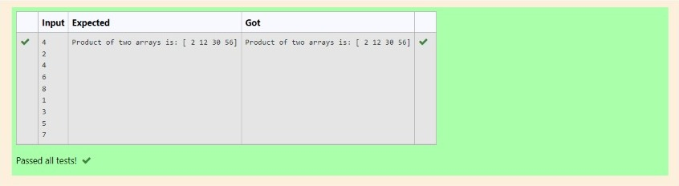

# Multiplying-two-matrix

## AIM:
### To multiply two matrixes
## ALGORITHM:

### Step 1:import numpy as np.
### Step 2:Assign empty array.
### Step 3:Enter the number.
### Step 4:Append the input to the arrays and assign. variable for the array.
### Step 5:Multiply the arrays and print the result.

## PROGRAM: 
### import numpy as np
### l1,l2=[],[]
### n=int(input())
### for i in range(n):
###    l1.append(int(input()))
### for i in range(n):
###    l2.append(int(input()))
### value1=np.array(l1)
### value2=np.array(l2)
### result=value1*value2
### print("Product of two arrays is:",result)
## OUTPUT:

## RESULT:
Hence the matrix is multiplied.
